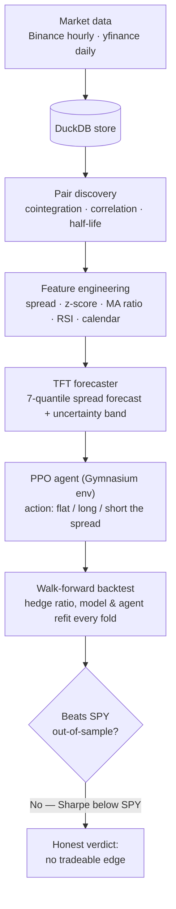
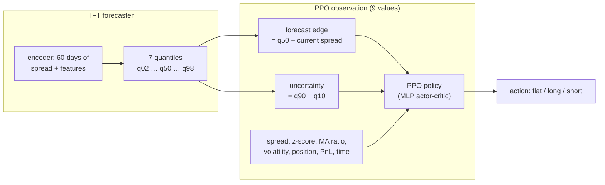

# tft-ppo-pairs-trader

Multi-asset pairs trading with TFT spread prediction and PPO execution.

[](https://github.com/Anjanamb/tft-ppo-pairs-trader/actions/workflows/ci.yml)
[](#roadmap)
[](https://www.python.org/)
[](LICENSE)
[](https://pytorch.org/)
[](https://duckdb.org/)

The idea: use a [Temporal Fusion Transformer](https://arxiv.org/abs/1912.09363) to forecast the spread between cointegrated asset pairs, then let a PPO agent decide when to enter/exit trades based on those forecasts + uncertainty estimates. Runs across crypto (Binance), US equities, ETFs, and commodities.

> **Status: research concluded (paused).** The full pipeline is built and CI-tested — data → pairs → TFT forecaster → PPO agent → Optuna tuning → walk-forward backtest → Streamlit dashboard, containerized with GitHub Actions CI. The investigation reached a clear, unvarnished conclusion: **under fully look-ahead-free walk-forward evaluation the strategy does not beat a SPY buy-and-hold** — and successive attempts to find an edge (regime filtering, a per-fold-retrained TFT) confirmed it (see [Results](#results)). The deliverable is a rigorous pipeline that evaluates honestly enough to reject its own hypothesis, rather than a fragile backtest Sharpe. See [Roadmap](#roadmap).

---

**Contents:** [Why](#why) · [Key concepts](#key-concepts-plain-english) · [How it works](#how-it-works) · [Models & parameters](#models-and-key-parameters) · [Setup](#setup) · [Usage](#usage) · [Results](#results) · [Limitations & lessons](#limitations-and-what-i-learned) · [Roadmap](#roadmap)

---

## Why?

Most pairs trading implementations use simple z-score thresholds. That works, but leaves alpha on the table — the entry/exit thresholds are static, there's no uncertainty awareness, and the strategy can't adapt to regime changes.

Here, the TFT provides multi-horizon spread forecasts with quantile uncertainty (so the agent knows when it's confident vs guessing), and the PPO agent learns a policy that adapts to market conditions rather than following fixed rules.

The multi-asset angle is the other differentiator. Running cointegration scans across crypto, equities, ETFs, and commodities surfaces pairs that single-asset-class strategies miss entirely (e.g., BNB/USDT ↔ XLF turned up as the highest-scoring pair in initial scans — a crypto exchange token cointegrated with the US financials ETF).

## Key concepts (plain English)

New to quant trading? Here's the whole vocabulary this project uses, in everyday terms.

- **Pair / pairs trading** — two assets that historically move together (e.g. two banks, or a gold ETF and gold futures). You bet on the *gap between them* returning to normal, not on the market going up or down. It's called **market-neutral** because it can profit whether the market rises or falls.
- **Spread** — the gap between the two assets' (log) prices: `spread = log(A) − β·log(B)`. This is the single number we forecast and trade.
- **Hedge ratio (β)** — how much of asset B offsets one unit of asset A so the spread stays stable; estimated by regressing one leg's price on the other's.
- **Cointegration** — a statistical test that two assets *genuinely* move together over the long run (not just briefly correlated). The Engle–Granger test returns a p-value; below 0.05 we treat the pair as cointegrated.
- **Half-life** — how many days the spread typically takes to close *half* of a deviation (from an Ornstein–Uhlenbeck fit). Shorter = faster reversion = more tradeable.
- **Z-score** — how unusual today's spread is, measured in standard deviations from its recent average. Near 0 = normal; beyond ±2 = stretched (a potential trade).
- **Mean reversion** — the assumption that a stretched spread snaps back toward its average. The entire strategy rests on this holding true.
- **Long / short / flat the spread** — *long* = bet the spread rises (buy A, sell B); *short* = bet it falls (sell A, buy B); *flat* = no position.
- **In-sample vs out-of-sample (OOS)** — *in-sample* is data the model trained on (optimistic); *out-of-sample* is unseen data (honest). A big gap between them means **overfitting**.
- **Look-ahead bias** — accidentally letting future information leak into a backtest. It's the #1 reason backtests look great and then fail live. We remove it by re-estimating everything (hedge ratio, model, agent) separately in each time window.
- **Walk-forward backtest** — train on a past window, test on the *next, unseen* window, roll forward, and repeat. The realistic way to measure a strategy.

### How performance is measured

- **Sharpe ratio** — return per unit of risk (volatility). Higher is better: <1 mediocre, 1–2 decent, 2–3 strong, >3 suspicious for a retail strategy.
- **Sortino ratio** — like Sharpe, but only penalizes *downside* swings (ignores upside volatility).
- **Max drawdown** — the worst peak-to-trough loss; i.e. how much pain you'd have endured.
- **Calmar ratio** — annual return ÷ max drawdown.
- **Profit factor** — gross profit ÷ gross loss; >1 makes money, =1 breaks even.
- **Win rate** — fraction of periods that were profitable.
- **Benchmark (SPY)** — the S&P 500 ETF, i.e. "just buy the whole US market and hold." Any active strategy has to beat this to be worth the effort and risk.

## Papers behind this

- Lim et al. (2021) — [Temporal Fusion Transformers for Interpretable Multi-horizon Time Series Forecasting](https://arxiv.org/abs/1912.09363)
- Han et al. (2023) — [Select and Trade: Towards Unified Pair Trading with Hierarchical Reinforcement Learning](https://arxiv.org/abs/2301.10724)
- Peik et al. (2025) — [Adaptive Temporal Fusion Transformer for Cryptocurrency](https://arxiv.org/abs/2509.10542), which flags TFT + RL integration as future work

## How it works

The pipeline turns raw prices into a trading decision, then evaluates it honestly:



1. **Data** — pull 5 years of OHLCV (crypto hourly via Binance, equities/ETFs/commodities daily via yfinance) into a single DuckDB store. *Why DuckDB:* fast columnar analytics, no CSV sprawl.
2. **Pair discovery** — scan every ticker combination for **cointegration** (genuine long-run co-movement), filter by correlation and **half-life**, and rank by a composite quality score. *Why:* only truly co-moving pairs mean-revert tradeably.
3. **Feature engineering** — turn each pair's spread into model inputs (z-score, moving-average ratio, volatility/volume ratios, spread RSI, calendar features).
4. **TFT forecaster** — predict the next-step spread with a **quantile** band, so the agent gets both a point forecast (median) and an *uncertainty* estimate.
5. **PPO agent** — a reinforcement-learning trader that, given the spread stats + the TFT forecast/uncertainty, decides each step to go **flat / long / short** — handling timing, exits, and transaction costs that a pure forecaster can't.
6. **Walk-forward backtest** — the honesty engine: train on a past window, test on the next unseen one, roll forward. The hedge ratio, the TFT, and the agent are **all re-fit per fold**, so nothing is ever evaluated on data it saw.

Adding a new ticker = one line in `config.yaml`. Swapping the RL algorithm = change `algorithm: "PPO"` to `"SAC"` or `"A2C"` (Stable-Baselines3 handles the rest). New prediction model = implement the `BasePredictor` interface.

## Models and key parameters

The two models split the job: the **TFT predicts**, the **PPO agent acts** on that prediction. Here's how the forecast flows into the agent's decision:



### TFT — the spread forecaster

A **Temporal Fusion Transformer**: an attention-based time-series model that mixes a static-pair embedding, an LSTM encoder/decoder, and interpretable multi-head attention. One model is trained across **all** pairs at once (with per-pair target normalization), and it outputs **quantiles** rather than a single number — giving the agent an uncertainty band, not just a guess. Key settings (`config.yaml › tft`):

| Hyperparameter | Value | What it means |
| --- | --- | --- |
| `max_encoder_length` | 60 | days of history the model looks back on |
| `max_prediction_length` | 5 | forecast horizon (days ahead) |
| `quantiles` | 0.02 … 0.98 (7) | uncertainty band; `q50` is the point forecast |
| `hidden_size` | 64 | model width |
| `attention_head_size` | 4 | interpretable attention heads |
| `dropout` | 0.1 | regularization |
| `learning_rate` | 1e-3 | Adam step size |
| `max_epochs` | 100 | with early stopping (patience 10) |

### PPO — the trading agent

**Proximal Policy Optimization** (Stable-Baselines3) on a custom Gymnasium environment. The agent observes 9 values (spread stats + the TFT's forecast edge and uncertainty + its position/PnL) and picks a **target position** each step. Key settings (`config.yaml › ppo`):

| Hyperparameter | Value | What it means |
| --- | --- | --- |
| `policy` | MlpPolicy | small MLP actor-critic |
| `learning_rate` | 3e-4 | step size |
| `n_steps` | 2048 | experience collected per update |
| `batch_size` | 64 | minibatch |
| `gamma` | 0.99 | reward discount |
| `gae_lambda` | 0.95 | advantage smoothing |
| `clip_range` | 0.2 | PPO trust-region clip |
| `ent_coef` | 0.01 | exploration bonus |
| `total_timesteps` | 30k/fold (500k full) | training budget |

**Environment & costs** — action space `Discrete(3)` (flat / long / short); reward is **mark-to-market**: `positionₜ · Δspread − cost · |Δposition|`, so the episode's total reward equals realized PnL. Costs = **10 bps** commission + **5 bps** slippage charged on every position change.

**Backtest windows** — train **504 days (~2y)**, test **63 days (~3mo)**, roll forward 63 days; hedge ratio (and, with `--tft`, the TFT) re-estimated each fold.

## Setup

Needs Python 3.11 (pytorch-forecasting has issues on 3.13). If you're on conda:

```bash
conda create -n pairs-trader python=3.11 -y
conda activate pairs-trader

# PyTorch first. Only `torch` is needed (no torchvision/torchaudio).
# CPU build runs the whole project and is the simplest path:
pip install torch --index-url https://download.pytorch.org/whl/cpu

# For an NVIDIA GPU, pick the CUDA build matching your driver from
# https://pytorch.org/get-started/locally/  (e.g. cu124). The project was
# built and tested against torch 2.5–2.6.

# Everything else (pytorch-forecasting, lightning, SB3, gymnasium, ...):
pip install -r requirements.txt
```

> If a `--index-url` install fails with `No matching distribution found`, it's
> almost always a transient network/proxy hiccup — just retry the command.

## Usage

```bash
# 1. Pull 5 years of data for all configured tickers
python scripts/data_refresh.py

# 2. Scan for cointegrated pairs
python scripts/find_pairs.py

# 3. Train the TFT spread forecaster (quantile outputs + variable importance)
python scripts/train_tft.py --top 5 --interpret

# 4. Train the PPO agent on the forecasts (auto-uses the latest TFT checkpoint)
python scripts/train_ppo.py

# 5. Tune PPO against out-of-sample Sharpe (Optuna + MLflow + SQLite)
python -m src.tuning.optimizer --target ppo --n-trials 50

# 6. Walk-forward backtest vs a SPY benchmark (hedge ratio refit per fold)
python scripts/run_backtest.py --strategy both        # rule + PPO baselines
python scripts/run_backtest.py --strategy ppo --tft   # PPO on a per-fold TFT

# 7. Launch the dashboard
streamlit run src/dashboard/app.py
```

## Tests, CI & Docker

```bash
pytest                       # 41 tests; data-dependent ones skip without a DB
ruff check src/ scripts/ tests/

docker compose up dashboard           # serve the dashboard on :8501
docker compose run --rm data-refresh  # one-shot data pull
```

GitHub Actions runs ruff + the full test suite on every push (CPU-only PyTorch;
synthetic model/agent/backtest tests train tiny models for real).

## What's in the box

```text
configs/config.yaml        <- all tickers, model params, schedules
src/data/                  <- data sources (yfinance, ccxt) + DuckDB manager
src/pairs/selector.py      <- cointegration tests, half-life, pair ranking
src/models/                <- feature engineering, TFT dataset builder, TFT predictor
src/agents/                <- Gymnasium env, SB3 agent wrapper, evaluation + baselines
src/tuning/                <- Optuna search spaces + optimizer (OOS-Sharpe objective)
src/backtest/              <- walk-forward engine, metrics, strategies
src/dashboard/             <- Streamlit app (logic in data.py, UI in app.py)
scripts/                   <- entry points (data refresh, pair scan, train, backtest)
tests/                     <- pytest suite (synthetic data; runs in CI)
```

## Results

**Pair discovery** — scan across 22 assets surfaced 12 cointegrated pairs, including cross-asset (crypto ↔ equity) and negatively correlated ones:

```text
BNB/USDT ↔ XLF     corr=0.888  coint_p=0.010  half_life=21.0d  score=0.892
GC=F     ↔ GS      corr=0.967  coint_p=0.006  half_life=33.4d  score=0.839
GLD      ↔ GS      corr=0.966  coint_p=0.006  half_life=34.5d  score=0.831
JPM      ↔ SPY     corr=0.984  coint_p=0.021  half_life=28.5d  score=0.784
AAPL     ↔ NVDA    corr=0.933  coint_p=0.008  half_life=39.8d  score=0.756
```

**TFT forecaster** — trains across all pairs at once with per-pair target normalization and 7-quantile output. Variable importance is sensible: the spread level (35%) and its z-score (16%) dominate, exactly what cointegration theory predicts; engineered volume/volatility ratios add little.

**PPO agent vs baselines (single holdout, BNB/USDT ↔ XLF)** — PPO beat a z-score rule and random, the only policy positive out-of-sample (Sharpe 1.14 OOS vs 4.47 in-sample — the gap is the overfitting tax, shown rather than hidden).

**The honest verdict — walk-forward (12 folds, 744 OOS days, fully look-ahead-free):**

Every strategy is refit per fold, the hedge ratio is re-estimated per fold, and the TFT is retrained per fold on train-only data — so nothing below has seen its own evaluation window.

| Strategy                     | Ann. return | Sharpe | Max DD | Profit factor |
|------------------------------|------------:|-------:|-------:|--------------:|
| z-score rule                 |       +0.11 |   0.21 |   0.61 |          1.05 |
| z-score + regime filter      |       +0.08 |   0.18 |   0.62 |          1.04 |
| PPO + per-fold TFT forecasts |       −0.30 |  −0.56 |   1.23 |          0.90 |
| SPY buy-and-hold (benchmark) |       +0.20 |   1.32 |   0.21 |          1.28 |

Under rigorous evaluation the result is unambiguous: the z-score rule barely breaks even, a mean-reversion **regime filter does not help**, and the **PPO agent — even fed genuinely look-ahead-free TFT forecasts retrained every fold — loses money** and gets nowhere near just holding SPY. The flattering single-holdout result (Sharpe 1.14) did not survive, and successive attempts to rescue it (regime gating, per-fold TFT) confirmed there is no tradeable edge here.

That *is* the finding. The engineering value of this project is a complete, CI-tested pipeline that **evaluates honestly enough to kill its own false positives** — the opposite of a backtest that quietly leaks the future to manufacture a Sharpe.

## Limitations and what I learned

Being explicit about *why* the result came out the way it did — this is the most important section for understanding the project honestly.

- **TFT was over-engineered for this problem.** A Temporal Fusion Transformer shines on *rich* forecasting tasks: many related series, many covariates, multi-horizon. A single spread on ~1,000 daily points is data-poor and low-dimensional — a **gradient-boosted tree (LightGBM/XGBoost) would be the appropriate, less overfit-prone forecaster** here. Choosing TFT was a deliberate learning/portfolio decision, not the statistically optimal one. (The `BasePredictor` interface makes swapping it a small change.)
- **Daily frequency is too coarse.** Mean-reversion edge in pairs trading largely lives *intraday* — the gap opens and closes within hours. Sampling once per day likely caps the achievable edge more than any model choice does.
- **A single pair is inherently low-Sharpe.** Real statistical-arbitrage desks diversify across *dozens to hundreds* of pairs; each has a tiny, noisy edge, and diversification is what produces a good Sharpe. One pair is high-variance by construction.
- **Cointegration is unstable out-of-sample.** Relationships drift, and some discovered "pairs" (e.g. BNB/USDT ↔ XLF — a crypto token vs a financials ETF) are *economically spurious* — they look cointegrated by chance and don't persist live.
- **RL is hard and data-hungry.** PPO on one short series overfits in-sample and generalizes poorly. Crucially, the **no-ML z-score control also failed**, which tells us the bottleneck is the *signal*, not just the agent — even a perfectly trained PPO likely wouldn't beat SPY here.
- **The benchmark framing matters.** SPY is a *directional* bull-market bet, and we tested in a rising market that flatters it. A market-neutral strategy's real value is **low correlation to the market** and resilience when it falls — not beating SPY's raw Sharpe in a bull run.
- **Institutional practice: ML *layers on* classical, not instead of it.** Production stat-arb uses cointegration / Kalman filters / Ornstein–Uhlenbeck models as the backbone, with ML as a *selective overlay* (pair selection, regime detection, sizing) — rarely end-to-end deep learning + RL as the sole decision-maker.

**What a v2 would do differently:** a classical core (Kalman **dynamic** hedge ratio + OU mean-reversion timing) with gradient boosting as a light filter; a **portfolio of many economically-linked, stability-screened pairs**; higher-frequency data; and judged by *correlation to SPY and blended-portfolio Sharpe*, not standalone return in a bull market.

## Data

Stored in DuckDB locally. Current dataset:

- **Crypto**: ~44k hourly candles per ticker (BTC, ETH, BNB, SOL, ADA)
- **Equities/ETFs/Commodities**: ~1,255 daily bars per ticker (SPY, QQQ, AAPL, MSFT, NVDA, GLD, XOM, etc.)

Data refreshes via cron (`scripts/data_refresh.py`), pair scans run weekly (`scripts/find_pairs.py`).

## Roadmap

- [x] Multi-source data pipeline
- [x] DuckDB storage
- [x] Cointegration-based pair discovery
- [x] Gymnasium trading environment
- [x] Feature engineering + TFT dataset builder
- [x] TFT spread predictor with quantile outputs
- [x] PPO agent training
- [x] Optuna hyperparameter tuning
- [x] Walk-forward backtesting with realistic costs
- [x] Streamlit dashboard
- [x] GitHub Actions CI + Docker deployment
- [x] Edge-hunting experiments: regime filter + per-fold TFT — both showed no out-of-sample edge (conclusion above)
- [ ] *(not pursued — paused)* Live paper trading + signal alerts
- [ ] *(not pursued — paused)* Further modeling (reward shaping, richer features); unlikely to overturn the verdict on daily data

## License

[MIT](LICENSE) — see [Anjana Bandara](https://anjanamb.github.io/) for more projects.
